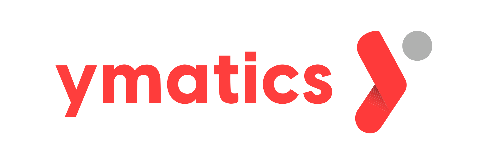

<a name="readme-top"></a>
<br />
<div align="center">
<a href="https://github.com/YMSAISolutionDev1/yms-mvds">

</a>
</div>

<h3 align="center">Ymatics Connector</h3>
<p align="center" style="padding-bottom:16px">
Extended EDC Connector by Ymatics.

## About The Project

[Eclipse Dataspace Components](https://github.com/eclipse-edc) (EDC) is a framework
for building dataspaces, exchanging data securely with ensured data sovereignty.

[Ymatics](https://ymatics.com/) extends the EDC Connector's functionality with extensions to offer
enterprise-ready managed services like "Connector-as-a-Service", out-of-the-box fully configured DAPS
and integrations to existing other dataspace technologies.

This repository contains our Ymatics Connector.

Check out our [Getting Started Section](#getting-started) on how to run a local Ymatics Connector.

## Requirements
```
Docker Environment(with docker compose)
JDK 17
GitHub Maven Registry Access
Node (>20)
```
To access the GitHub Maven Registry you need to provide the following properties, e.g. by providing
a `~/.gradle/gradle.properties`.

```properties
gpr.user={your github username}
gpr.key={your github pat with packages.read}
```

if you use npm, then do npm install before start
```
cd ./connector-ui/
npm install
```

## Getting Started(Local Demo)
You need Docker and Docker Compose to start local demo.
```angular2html
sudo apt update

sudo apt install apt-transport-https ca-certificates curl software-properties-common

curl -fsSL https://download.docker.com/linux/ubuntu/gpg | sudo apt-key add -

sudo add-apt-repository "deb [arch=amd64] https://download.docker.com/linux/ubuntu bionic stable"

sudo apt update

sudo apt install docker-ce

sudo curl -L "https://github.com/docker/compose/releases/download/latest/docker-compose-$(uname -s)-$(uname -m)" -o /usr/local/bin/docker-compose

sudo chmod +x /usr/local/bin/docker-compose

sudo ln -s /usr/local/bin/docker-compose /usr/bin/docker-compose

docker-compose --version
```
You should login to [ghcr.io](https://github.com/features/actions) before start.
```angular2html
docker login ghcr.io -u username --password "Access Token Value"
```
Clone our repository first
```angular2html
git clone https://github.com/Ymatics-Co/yms-mvds.git
```
Then, build the themed frontend UIs.
Navigate to the `connector-ui` directory. These scripts will build the Angular application for each theme and then build the corresponding Docker image.

```bash
cd connector-ui

# build Angular app
ng build

# Give execute permissions to the build scripts (e.g., in WSL/Linux)
# These scripts build the Angular app and the themed Docker image.
chmod +x ./build-yms-front.sh
chmod +x ./build-koti-front.sh
chmod +x ./build-kalda-front.sh

# Run the build scripts for each theme
# For Ymatics theme (Consumer UI)
bash ./build-yms-front.sh

# For KOTI theme (Provider UI)
bash ./build-koti-front.sh

# For KALDA theme (Consumer2 UI)
bash ./build-kalda-front.sh

# For KHU theme
bash ./build-khu-front.sh

# After building, navigate back to the workspace root or proceed to the compose directory
cd ..
```

After then, go to docs/deployment-guide/goals/local-demo-ce, and activate docker compose
```angular2html
cd docs/deployment-guide/goals/local-demo-ce # Corrected path if building from connector-ui and then cd ..
docker compose up -d --build
docker compose logs -f
```
then, happy sharing!

## Accessing UIs and Services

Once the Docker containers are up and running, you can access the services at the following URLs:

**Connector UIs:**
- Provider Connector UI (KOTI Theme): [http://localhost:11000](http://localhost:11000)
- Consumer Connector UI (Ymatics Theme): [http://localhost:22000](http://localhost:22000)
- Consumer2 Connector UI (KALDA Theme): [http://localhost:23000](http://localhost:23000)
- KHU Connector UI (KHU Theme): [http://localhost:24000](http://localhost:24000)

**Supporting Service UIs (Data Management):**
- Provider Datasource/Sink UI: [http://localhost:4200](http://localhost:4200)
- Consumer Datasource/Sink UI: [http://localhost:4201](http://localhost:4201)
- Consumer2 Datasource/Sink UI: [http://localhost:4202](http://localhost:4202)
- KHU Datasource/Sink UI: [http://localhost:4203](http://localhost:4203)

**Backend Service Endpoints (API):**
- Provider Datasink Backend: `http://localhost:8000`
- Provider Datasource Backend: `http://localhost:8001`
- Consumer Datasink Backend: `http://localhost:8002`
- Consumer Datasource Backend: `http://localhost:8003`
- Consumer2 Datasink Backend: `http://localhost:8004`
- Consumer2 Datasource Backend: `http://localhost:8005`
- KHU Datasink Backend: `http://localhost:8006`
- KHU Datasource Backend: `http://localhost:8007`

## License

Distributed under the `LICENSE`. Some deliverables such as APIs, API Clients and Utility Libraries remain under the `Apache License 2.0`. See [LICENSE](LICENSE) for more information.

## Contact

contact@ymatics.com

<p align="right">(<a href="#readme-top">back to top</a>)</p>
